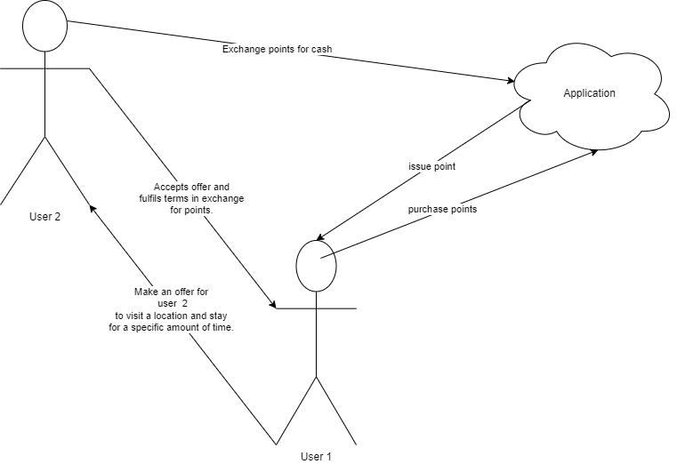

# Introduction

# System Requirement

# How to start the application
1. Clone the git repo
1. mvn clean install
1. mvn spring-boot:run

# Application Overview

### Offer

### Acceptable
An offer is acceptable if the user is at the location.

### Accepted
After an offer is accepted the duration timer starts. If the user leaves the location the timer will stop. Offers can have more acceptances than the specified number of takers. This is resolved based on the first to complete. only completed acceptances will get a reward.

#Features

# Road Map
* Deploy the application for testing
* Add pedometer
* Add push notification